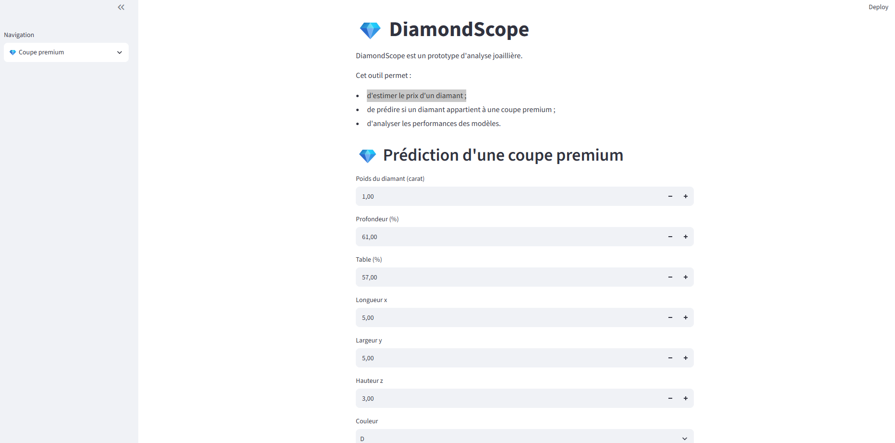

# 💎 DiamondScope

## 📌 Présentation du projet

DiamondScope est un prototype d'application d'analyse joaillière développé avec **Streamlit**.

L'objectif est d'aider à l'évaluation d'un diamant grâce à des modèles de Machine Learning capables de :

- 💰 estimer son prix ;
- 💎 prédire si un diamant appartient à une coupe premium ;
- 📊 analyser les performances des modèles utilisés.

---
## 🚀 Tester l'application : 👉 Accéder à DiamondScope : [Ouvrir l'application Streamlit](http://localhost:8501/)
---
## 📸 Aperçu de l'application


---

## 🚀 Fonctionnalités

### 💰 Prédiction du prix

L'utilisateur renseigne les caractéristiques du diamant :

- poids (carat) ;
- profondeur ;
- table ;
- couleur ;
- clarté.

Le modèle de régression estime ensuite un prix en dollars.

---

### 💎 Classification Premium

L'application utilise un modèle de classification afin de prédire si un diamant correspond à une coupe premium.

Les variables utilisées :

- carat ;
- profondeur ;
- table ;
- dimensions (x, y, z) ;
- couleur ;
- clarté.

---

### 📊 Analyse des résultats

Une page dédiée présente :

- les variables influençant le prix ;
- les performances du modèle de classification ;
- la matrice de confusion.

---

## 🤖 Modèles Machine Learning

Deux modèles ont été utilisés :

### Régression linéaire

Objectif :
- prédire le prix du diamant.

### KNN (K-Nearest Neighbors)

Objectif :
- classifier les diamants selon leur potentiel premium.

Performance obtenue :

- Accuracy : **78 %**
- Rappel Premium : **90 %**

---

## 🛠️ Technologies utilisées

- Python
- Pandas
- Scikit-learn
- Streamlit
- Pickle
- UV pour la gestion des dépendances

---
## 📂 Données

Le modèle a été entraîné sur un jeu de données de diamants contenant des caractéristiques physiques :

- carat ;
- coupe ;
- couleur ;
- clarté ;
- profondeur ;
- dimensions du diamant ;
- prix.

Ces variables ont été utilisées pour entraîner les modèles de Machine Learning.
---

## ▶️ Installation et lancement

Installer les dépendances :

```bash
uv sync


